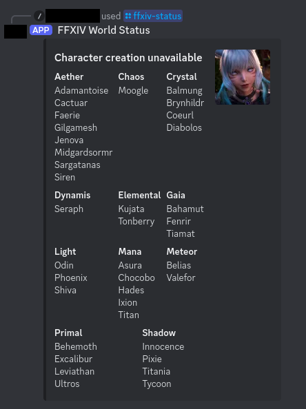

# `ffxiv-world-status-discord`

Discord bot to check status of FFXIV worlds.

## Commands

### `/ffxiv-status`



## Development

## Configuration

* `cp compose.override.yaml.example compose.override.yaml`
* Modify `compose.override.yaml` to match your environment.

### Start

```sh
docker compose \
    -f compose.yaml \
    -f compose.override.yaml \
    up \
    --abort-on-container-exit \
    --build
```

### Stop

* If `docker compose` is running on foreground, `Ctrl+C` should stop it.
* If `docker compose` is running on background, then the command from the "Cleanup" section below should stop it.

### Cleanup

```sh
docker compose \
    -f compose.yaml \
    -f compose.override.yaml \
    down \
    --volumes \
    --remove-orphans \
    --rmi local
```

## License

* `assets/fankit`: See <https://eu.finalfantasyxiv.com/lodestone/special/fankit/>.
* Everything else: MPL 2.0.
